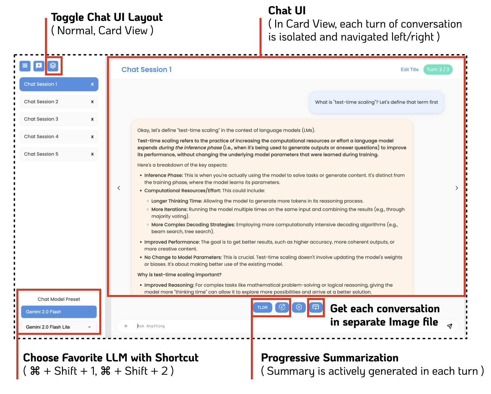

# convo

A modern chat interface that provides a unified experience for interacting with multiple AI models. The application supports seamless integration with leading AI providers including OpenAI, Anthropic, Google, Hugging Face, and Mistral. 

Users can easily switch between different models and take advantage of features like chat summarization, conversation history, and file attachments. 



## Setup

```bash
$ cd server
$ pip install -r requirements.txt
$ uvicorn main:app --reload
```

In the browser, go to `http://localhost:8000/statics` to see the api docs

## Acknowledgements

Thanks to Mistral.AI, Google Developer Program, and Upstage for providing the credits for building up this project.

## License

This project is licensed under the MIT License. See the [LICENSE](LICENSE) file for details.

